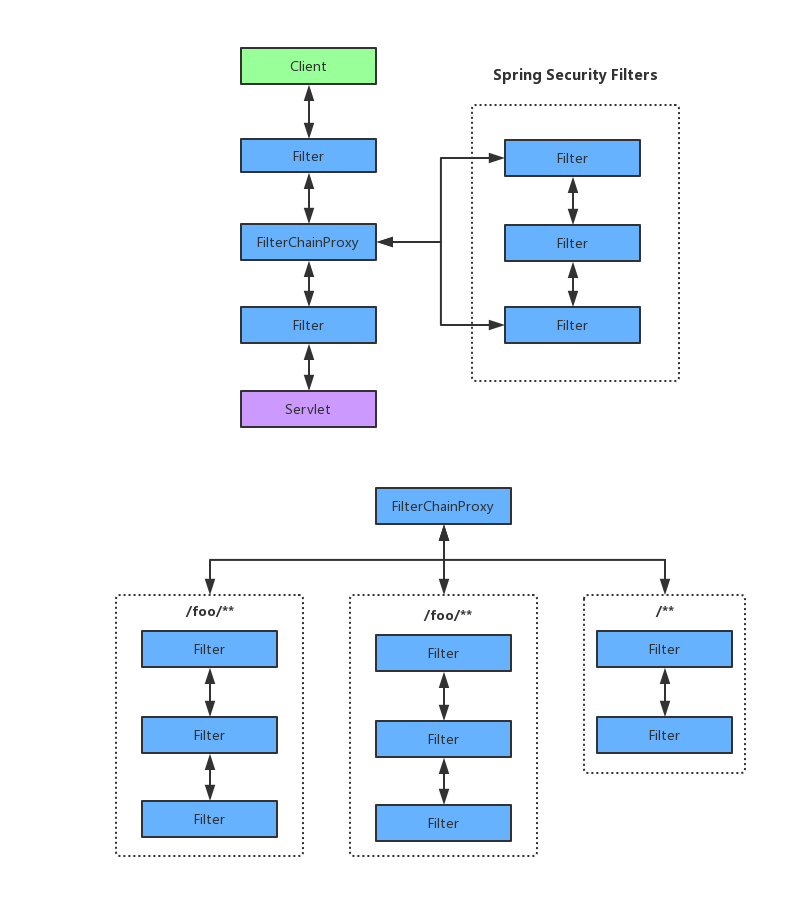
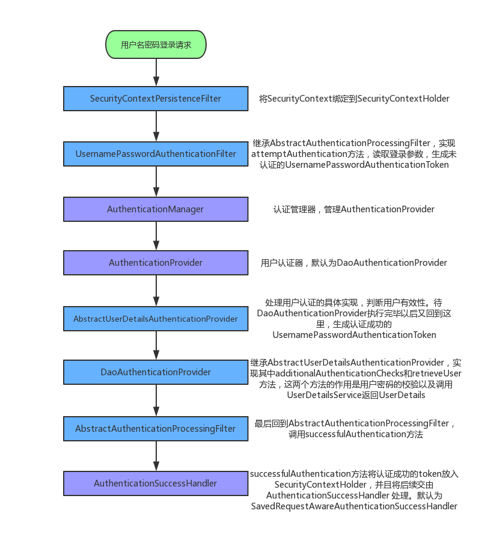

# Taroco-Authentication 统一认证服务

[](https://github.com/liuht777/Taroco-Authentication)
[](https://app.codacy.com/app/liuht777/Taroco-Authentication?utm_source=github.com&utm_medium=referral&utm_content=liuht777/Taroco-Authentication&utm_campaign=Badge_Grade_Dashboard)
[](https://github.com/liuht777/Taroco-Authentication)
[](https://github.com/liuht777/Taroco/blob/master/LICENSE)

基于 Spring Security Oauth2 的统一认证服务，采用 [Ant Design Pro of Vue](https://pro.loacg.com/docs/getting-started "Ant Design Pro of Vue") 作为前端界面，重写了 Spring Security 登录模式，支持异步登录，所有接口以及授权端点都支持异步的方式。


## 支持特性

- 支持异步 JSON 登录
- 支持手机号、验证码登录
- 支持 SSO
- 支持 JWT Token
- 支持 Redis Token
- 支持集群部署（已集成 Spring Session）
- 支持 OAuth2.0 定义的四种授权码模式以及刷新 token
- 支持通过手机号和验证码获取 token（类似 password模式）
- 集成了应用管理的功能，方便应用接入
- 完整的 Demo 示例，包括 SSO、Resource Server，以及在 Resource Server 中解析token，获取用户的权限以及认证中添加的额外信息

## Postman 接口调试

前端界面已经集成到 Spring Boot，只需要启动一个后端服务即可。`docs/Taroco Authentication.postman_collection.json` 已导出，请自行导入到 Postman 进行接口调试。

## Spring Security 过滤器解析

Spring Security 默认是通过 WebSecurityConfigurerAdapter.getHttp() 方法配置进来的。通过继承 WebSecurityConfigurerAdapter 类并且重写 configure(HttpSecurity http) 方法，可以定义自己的 Spring Security 配置。

|名称   |简介   |
| :------------ | :------------ |
|WebAsyncManagerIntegrationFilter   |将SecurityContext与Spring Web中用于处理异步请求映射的 WebAsyncManager 进行集成。   |
|SecurityContextPersistenceFilter   |将SecurityContext绑定到SecurityContextHolder，以及最后的清空SecurityContextHolder   |
|HeaderWriterFilter   |将指定的头部信息写入响应对象   |
|CsrfFilter   |防止跨站请求伪造，对请求进行csrf保护   |
|LogoutFilter   |检测用户退出登录请求并做相应退出登录处理   |
|UsernamePasswordAuthenticationFilter   |检测用户名/密码表单登录认证请求并作相应认证处理: 1.session管理，比如为新登录用户创建新session(session fixation防护)和设置新的csrf token等 2.经过完全认证的Authentication对象设置到SecurityContextHolder中的SecurityContext上; 3.发布登录认证成功事件InteractiveAuthenticationSuccessEvent 4.登录认证成功时的Remember Me处理 5.登录认证成功时的页面跳转 |
|BasicAuthenticationFilter   |检测和处理http basic认证，认证信息以 Authorization : Basic [Token] 方式填充进 HTTPHeader。Token组成方式为username:password 并进行base64转码。   |
|RequestCacheAwareFilter   |提取请求缓存中缓存的请求 1.请求缓存在安全机制启动时指定 2.请求写入缓存在其他地方完成 3.典型应用场景: (1).用户请求保护的页面， (2).系统引导用户完成登录认证, (3).然后自动跳转到到用户最初请求页面   |
|SecurityContextHolderAwareRequestFilter   |包装请求对象使之可以访问SecurityContextHolder,从而使请求真正意义上拥有接口HttpServletRequest中定义的getUserPrincipal这种访问安全信息的能力   |
|RememberMeAuthenticationFilter   |针对Remember Me登录认证机制的处理逻辑   |
|AnonymousAuthenticationFilter   |如果当前SecurityContext属性Authentication为null，将其替换为一个AnonymousAuthenticationToken   |
|SessionManagementFilter   |检测从请求处理开始到目前是否有用户登录认证，如果有做相应的session管理，比如针对为新登录用户创建新的session(session fixation防护)和设置新的csrf token等。   |
|ExceptionTranslationFilter   |处理AccessDeniedException和 AuthenticationException异常，将它们转换成相应的HTTP响应   |
|FilterSecurityInterceptor   |一个请求的安全处理过滤器链的最后一个，检查用户是否已经认证,如果未认证执行必要的认证，对目标资源的权限检查，如果认证或者权限不足，抛出相应的异常:AccessDeniedException或者AuthenticationException   |

注意:
* 上面的 Filter 并不总是同时被起用，根据配置的不同，会启用不同的Filter。
* 对于被起用的Filter，在对一个请求进行处理时，位于以上表格上部的过滤器先被调用。
* 上面的Filter被启用时并不是直接添加到Servlet容器的Filter chain中,而是先被组织成一个FilterChainProxy, 然后这个Filter会被添加到Servlet容器的Filter chain中。
* 上面的Spring Security Filter被组合到一个FilterChainProxy的过程可以参考配置类WebSecurityConfiguration的方法Filter springSecurityFilterChain(),这是一个bean定义方法，使用的bean名称为AbstractSecurityWebApplicationInitializer.DEFAULT_FILTER_NAME:springSecurityFilterChain。
> FilterChainProxy也是一个Filter,它应用了代理模式和组合模式，它将上面的各个Filter组织到一起在自己内部形成一个filter chain,当自己被调用到时，它其实把任务代理给自己内部的filter chain完成。

## Spring Security 认证流程

Spring 针对 servlet 默认有一个过滤器链（Filter chain），Spring Security 本质上也是一个连续的 Filter 链，然后又以 FilterChainProxy 的形式被添加到 Servlet 容器的 Filter chain 当中。默认是使用 DefaultSecurityFilterChain，名称为：AbstractSecurityWebApplicationInitializer.DEFAULT_FILTER_NAME:springSecurityFilterChain。下图展示了 springSecurityFilterChain 是如何嵌入Servlet 容器的 Filter chain 当中:



我们以 Spring Security 用户名/密码登录为例展示认证的整体流程如下:



> 上图流程只是针对认证成功的主流程，实际上这任何一个环节都有可能失败，这时候会进入到 ExceptionTranslationFilter 过滤器进行处理。

## Spring Security 自定义开发

### 实现异步 JSON 登录

通过熟悉 Spring Security 的认证流程我们知道，读取登录请求参数的地方是在 UsernamePasswordAuthenticationFilter，要想实现异步登录，首先想到的就是重写它。
但是为了能够使表单登录和异步登录同时有效，我们需要继承 UsernamePasswordAuthenticationFilter，加入自己的逻辑。

1. 继承 UsernamePasswordAuthenticationFilter

```java
/**
 * 重写 UsernamePasswordAuthenticationFilter 类, 支持实现异步JSON登录
 *
 * @author liuht
 * 2019/7/3 14:09
 */
@Slf4j
public class CustomUsernamePasswordAuthenticationFilter extends UsernamePasswordAuthenticationFilter {

    @Override
    public Authentication attemptAuthentication(HttpServletRequest request, HttpServletResponse response) throws AuthenticationException {

        // 如果是JSON登录
        UsernamePasswordAuthenticationToken authRequest;
        if (request.getContentType().equals(MediaType.APPLICATION_JSON_UTF8_VALUE)
                || request.getContentType().equals(MediaType.APPLICATION_JSON_VALUE)) {
            ObjectMapper mapper = new ObjectMapper();

            try (InputStream is = request.getInputStream()) {
                AuthenticationBean authenticationBean = mapper.readValue(is, AuthenticationBean.class);
                authRequest = new UsernamePasswordAuthenticationToken(
                        authenticationBean.getUsername(), authenticationBean.getPassword());
                setDetails(request, authRequest);
                return this.getAuthenticationManager().authenticate(authRequest);
            } catch (IOException e) {
                log.error("异步登陆失败", e);
            }
        } else {
            // 支持原来默认的登录方式
            return super.attemptAuthentication(request, response);
        }
        authRequest = new UsernamePasswordAuthenticationToken("", "");
        return this.getAuthenticationManager().authenticate(authRequest);
    }
}

/**
 * 用户认证的Bean
 *
 * @author liuht
 * 2019/7/3 14:11
 */
@Data
public class AuthenticationBean {

    private String username;

    private String password;
}
```

2. 将自定义的 Filter 添加到 Spring Security 过滤器链当中

```java
@EnableWebSecurity
public class WebSecurityConfigration extends WebSecurityConfigurerAdapter {
    
    @Override
    protected void configure(HttpSecurity http) throws Exception {
        ExpressionUrlAuthorizationConfigurer<HttpSecurity>.ExpressionInterceptUrlRegistry registry =
                http
                        .addFilterAt(customAuthenticationFilter(), UsernamePasswordAuthenticationFilter.class);
    }
    
    /**
     * 注册自定义的UsernamePasswordAuthenticationFilter
     *
     * @throws Exception
     */
    @Bean
    public CustomUsernamePasswordAuthenticationFilter customAuthenticationFilter() throws Exception {
        CustomUsernamePasswordAuthenticationFilter filter = new CustomUsernamePasswordAuthenticationFilter();
        filter.setAuthenticationSuccessHandler(successHandler);
        filter.setAuthenticationFailureHandler(failureHandler);
        //这句很关键，重用WebSecurityConfigurerAdapter配置的AuthenticationManager，不然要自己组装AuthenticationManager
        filter.setAuthenticationManager(authenticationManagerBean());
        return filter;
    }
}
```

### 自定义手机号/验证码登录


## Spring Security OAuth2 授权码模式流程

## Spring Security OAuth2 SSO 流程

## Spring Security OAuth2 自定义开发

## 扩展

用户以及用户权限方面留给使用者自己去扩展，这里只是使用了一个 `MockUserService` 模拟了获取用户的过程，以及其他相关的角色、组织、接口权限都属于扩展的部分，统一认证只做认证做的事情。

```java
/**
 * 模拟 UserService 实现查询用户
 * 在实际使用上需要替换
 *
 * @author liuht
 * 2019/7/3 9:52
 */
@Service
public class MockUserService {

    @Autowired
    private PasswordEncoder encoder;

    /**
     * 根据用户名称返回用户
     *
     * @param username 用户名称,必须唯一
     * @return
     */
    public User findUserByUsername(String username) {
        final User user = new User();
        user.setUsername(username);
        // 密码和用户名保持一致
        user.setPassword(encoder.encode(username));
        user.setEnabled(true);
        user.setUserId(RandomUtil.randomInt());
        user.setEnabled(true);
        user.setExpired(false);
        user.setLocked(false);
        user.setPasswordExpired(false);
        user.setRoles(Collections.singletonList(defaultRole()));
        return user;
    }

    /**
     * 根据手机号返回用户
     *
     * @param mobile 手机号,必须唯一
     * @return
     */
    public User findUserByMobile(String mobile) {
        final User user = new User();
        user.setUsername(mobile);
        // 密码和用户名保持一致
        user.setPassword(encoder.encode(mobile));
        user.setEnabled(true);
        user.setUserId(RandomUtil.randomInt());
        user.setEnabled(true);
        user.setExpired(false);
        user.setLocked(false);
        user.setPasswordExpired(false);
        user.setRoles(Collections.singletonList(defaultRole()));
        return user;
    }

    private Role defaultRole() {
        return new Role(CommonConstants.ROLE_DEFAULT,
                Collections.singletonList(new Operation(CommonConstants.OP_DEFAULT)));
    }
}
```

## 友情链接

- [spring-security-oauth 开发者指南](http://projects.spring.io/spring-security-oauth/docs/oauth2.html)
- [Spring Boot & Spring Session](https://docs.spring.io/spring-session/docs/current/reference/html5/guides/boot-redis.html)
- [理解 OAuth 2.0（阮一峰）](http://www.ruanyifeng.com/blog/2014/05/oauth_2_0.html)
- [vue.ant.design](https://vue.ant.design/docs/vue/introduce-cn/)
- [Ant Design Pro of Vue](https://pro.loacg.com/docs/getting-started)
