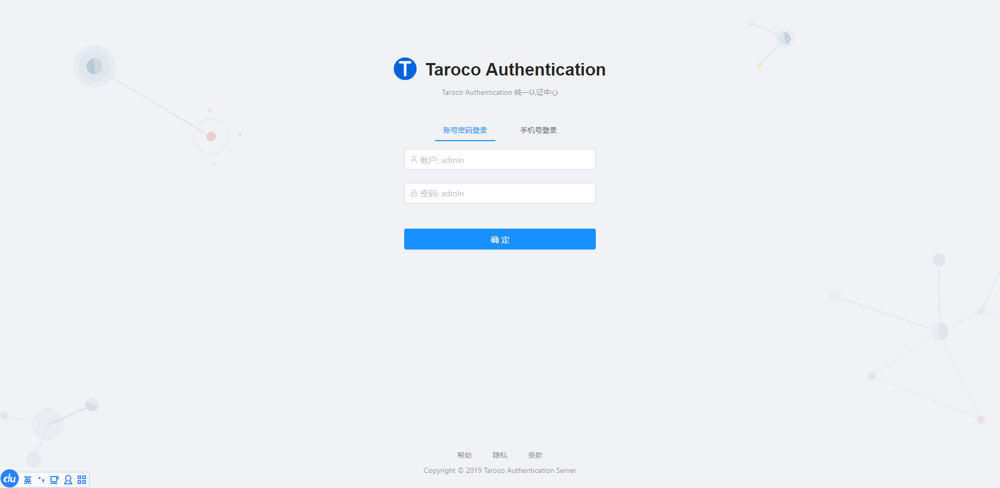

# Taroco-Authentication 统一认证服务

[](https://github.com/liuht777/Taroco-Authentication)
[](https://github.com/liuht777/Taroco-Authentication)
[](https://github.com/liuht777/Taroco/blob/master/LICENSE)

基于 Spring Security Oauth2 的统一认证服务，采用 [Ant Design Pro of Vue](https://pro.loacg.com/docs/getting-started "Ant Design Pro of Vue") 作为前端界面，重写了 Spring Security 登录模式，支持异步登录，所有接口以及授权端点都支持异步的方式。




## 支持特性

- 异步JSON登录的支持
- 手机号验证码登录
- SSO 支持
- 基于 JWT 的 Token 策略
- 支持 OAuth2 定义的四种授权码模式以及刷新 token
- 支持通过手机号和验证码获取 token
- 集成了应用管理的功能，方便应用接入

## Postman 接口调试

前端界面已经集成到 Spring Boot，只需要启动一个后端服务即可。[postman_collection.json](docs/Taroco Authentication.postman_collection.json) 已导出，请自行导入到 Postman 进行接口调试。

## 扩展

用户以及用户权限方面留给使用者自己去扩展，这里只是使用了一个 `MockUserService` 模拟了获取用户的过程，以及其他相关的角色、组织、接口权限都属于扩展的部分，统一认证只做认证做的事情。

```java
@Service
public class MockUserService {

    @Autowired
    private PasswordEncoder encoder;

    /**
     * 根据用户名称返回用户
     *
     * @param username 用户名称,必须唯一
     * @return
     */
    public UserVo findUserByUsername(String username) {
        final UserVo userVo = new UserVo();
        userVo.setUsername(username);
        // 密码和用户名保持一致
        userVo.setPassword(encoder.encode(username));
        userVo.setEnabled(true);
        userVo.setUserId(RandomUtil.randomInt());
        userVo.setEnabled(true);
        userVo.setExpired(false);
        userVo.setLocked(false);
        userVo.setPasswordExpired(false);
        return userVo;
    }

    /**
     * 根据手机号返回用户
     *
     * @param mobile 手机号,必须唯一
     * @return
     */
    public UserVo findUserByMobile(String mobile) {
        final UserVo userVo = new UserVo();
        userVo.setUsername(mobile);
        // 密码和用户名保持一致
        userVo.setPassword(encoder.encode(mobile));
        userVo.setEnabled(true);
        userVo.setUserId(RandomUtil.randomInt());
        userVo.setEnabled(true);
        userVo.setExpired(false);
        userVo.setLocked(false);
        userVo.setPasswordExpired(false);
        return userVo;
    }
}
```

## 友情链接

- [spring-security-oauth 开发者指南](http://projects.spring.io/spring-security-oauth/docs/oauth2.html)
- [理解 OAuth 2.0（阮一峰）](http://www.ruanyifeng.com/blog/2014/05/oauth_2_0.html)
- [vue.ant.design](https://vue.ant.design/docs/vue/introduce-cn/)
- [Ant Design Pro of Vue](https://pro.loacg.com/docs/getting-started)
